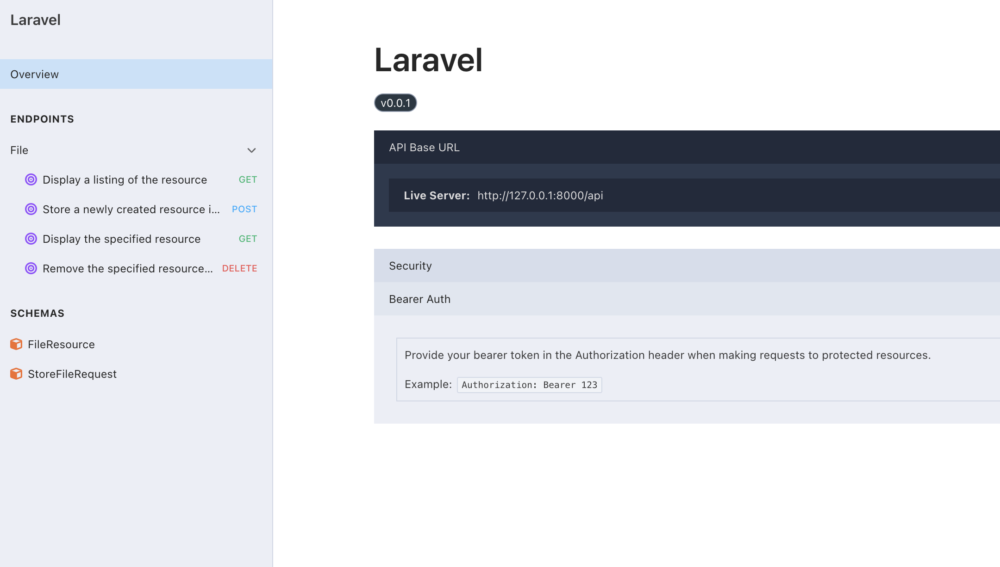

# Laravel Coding Test for Artificially

## Instructions

1. **Clone the Repository**  
   Clone this repository to your local environment:
   ```bash
   git clone git@github.com:robuedi/Laravel-Coding-Test.git
   cd Laravel-Coding-Test
    ```
2. **Setup the Project**
    - Install the project dependencies:
      ```bash
      composer install
      ```
    - Create a new `.env` file:
      ```bash
      cp .env.example .env
      ```
    - Generate an application key:
      ```bash
      php artisan key:generate
      ```
    - Create a new SQLite database:
      ```bash
      touch database/database.sqlite
      ```
    - Run the database migrations:
      ```bash
      php artisan migrate
      ```
    - Run the app using the dev server:
      ```bash
      php artisan serve
      ```
   - Run UI tests using the docs at http://127.0.0.1:8000/docs/api#/:
      
